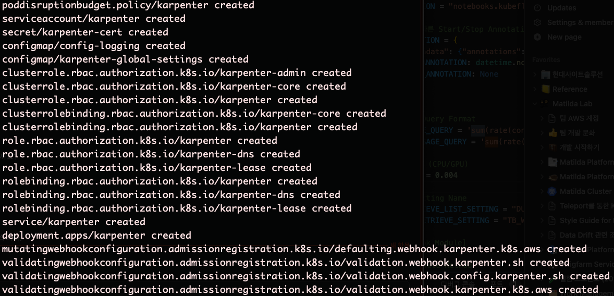

# AWS AutoScale

> AWS에서 제공하는 Node Auto Scale의 Karpenter, Cluster AutoScaler에 대한 문서

# Cluster Auto Scaler

## AWS Auto Scale Kubeflow Notebook Test

> AWS Cluster Auto Scaler를 기반으로 Kubeflow 노트북 생성 시 Auto Scale이 되는 것 확인을 위한 테스트 로그

### 테스트 1

- 내용 : CPU 16core / Memory 64Gi 기반 노트북 시작
- 테스트 결과
    - 해당 리소스를 할당받을 수 있는 여유 노드가 없어 스케줄링 불가
    - Node Group에서 해당 자원만큼을 할당해줄 수 있는 인스턴스가 없기 때문에 Cluster AutoScaler가 *Trigger 되지 않음*

### 테스트 2

- 내용 : CPU 10core / Memory 10Gi 기반 노트북 시작
- 테스트 결과
    - 해당 자원을 할당 가능한 노드가 없어, 인스턴스를 새롭게 생성
    - 소요 시간 : 약 3분
        - 인스턴스 환경 구성 소요 시간 : 약 50초 - 1분
        - 이미지 Pulling 및 Pod 시작까지 소요 시간 : 약 2분

### 테스트 3

- 내용 : CPU 4core / Memory 32Gi & CPU 8core / Memory 32Gi 노트북 시작
- 테스트 결과
    - 해당 자원을 할당 가능한 노드로 나누어서 Pod 생성

### 테스트 4

- 내용 : CPU 15core / Memory 32Gi 노트북 시작
- 테스트 결과
    - 새롭게 인스턴스를 AutoScale

    

- 참조
    - Pod가 노드에 리소스를 기반으로 스케줄링이 가능한지 판단할 때 해당 노드에 배포된 Pod의 자원 Request 값을 참조
        - 만약 특정 Pod에 Request 값이 없다면 해당 Pod의 자원은 계산되지 않음
    - 노드의 Request 값이 생성하고자 하는 Pod(노트북)의 Request 자원 값을 넘은 경우 오토스케일이 발생

---

## Karpenter

### Installation

- 환경 변수 설정

    ```bash
    export CLUSTER_NAME="eks-test-cluster"

    export KARPENTER_VERSION="v0.31.1"

    export CLUSTER_ENDPOINT="$(aws eks describe-cluster --name ${CLUSTER_NAME} --query "cluster.endpoint" --output text)"

    export AWS_ACCOUNT_ID=$(aws sts get-caller-identity --query 'Account' --output text)
    ```

- AWS Role & Policy 생성

    AWS Console에서 Karpenter를 위한 역할 생성

    - 역할 이름 : KarpenterInstanceNodeRole
    - 역할 목록
        1. AmazonEKSWorkerNodePolicy
        2. Amazon_CNI_Policy
        3. AmazonEC2ContainerRegistryReadOnly
        4. AmazonSSMManagedInstanceCore

    Karpenter Controller IAM 역할 구성

    ```bash
    echo '{
        "Statement": [
            {
                "Action": [
                    "ssm:GetParameter",
                    "iam:PassRole",
                    "ec2:DescribeImages",
                    "ec2:RunInstances",
                    "ec2:DescribeSubnets",
                    "ec2:DescribeSecurityGroups",
                    "ec2:DescribeLaunchTemplates",
                    "ec2:DescribeInstances",
                    "ec2:DescribeInstanceTypes",
                    "ec2:DescribeInstanceTypeOfferings",
                    "ec2:DescribeAvailabilityZones",
                    "ec2:DeleteLaunchTemplate",
                    "ec2:CreateTags",
                    "ec2:CreateLaunchTemplate",
                    "ec2:CreateFleet",
                    "ec2:DescribeSpotPriceHistory",
                    "pricing:GetProducts"
                ],
                "Effect": "Allow",
                "Resource": "*",
                "Sid": "Karpenter"
            },
            {
                "Action": "ec2:TerminateInstances",
                "Condition": {
                    "StringLike": {
                        "ec2:ResourceTag/Name": "*karpenter*"
                    }
                },
                "Effect": "Allow",
                "Resource": "*",
                "Sid": "ConditionalEC2Termination"
            }
        ],
        "Version": "2012-10-17"
    }' > controller-policy.json
    ```

    ```bash
    aws iam create-policy --policy-name KarpenterControllerPolicy-${CLUSTER_NAME} --policy-document file://controller-policy.json
    ```

    ```bash
    # EKS Cluster용 OIDC ID Provider가 이미 있으면 수행하지 않음
    eksctl utils associate-iam-oidc-provider --cluster ${CLUSTER_NAME} --approve
    ```

    ```bash
    eksctl create iamserviceaccount \
      --cluster "${CLUSTER_NAME}" --name karpenter --namespace karpenter \
      --role-name "KarpenterControllerRole-${CLUSTER_NAME}" \
      --attach-policy-arn "arn:aws:iam::${AWS_ACCOUNT_ID}:policy/KarpenterControllerPolicy-${CLUSTER_NAME}" \
      --approve \
      --role-only
    ```

    Karpenter가 사용할 Subnet을 판단하기 위해 EKS Node Group, Subnet에 Tag 추가

    ```bash
    for NODEGROUP in $(aws eks list-nodegroups --cluster-name ${CLUSTER_NAME} \
        --query 'nodegroups' --output text); do aws ec2 create-tags \
            --tags "Key=karpenter.sh/discovery,Value=${CLUSTER_NAME}" \
            --resources $(aws eks describe-nodegroup --cluster-name ${CLUSTER_NAME} \
            --nodegroup-name $NODEGROUP --query 'nodegroup.subnets' --output text )
    done
    ```

- Helm YAML Template Base 설정

    ```bash
    helm template karpenter oci://public.ecr.aws/karpenter/karpenter --version ${KARPENTER_VERSION} --namespace karpenter \
        --set settings.aws.defaultInstanceProfile=default \
        --set settings.aws.clusterEndpoint="${CLUSTER_ENDPOINT}" \
        --set settings.aws.clusterName=${CLUSTER_NAME} \
        --set serviceAccount.annotations."eks\.amazonaws\.com/role-arn"="arn:aws:iam::${AWS_ACCOUNT_ID}:role/AmazonEKSNodeRole" > karpenter.yaml
    ```

- YAML 파일 수정

    ```bash
    vi karpenter.yaml
    ```

    ```yaml
    # ...
          affinity:
            nodeAffinity:
              requiredDuringSchedulingIgnoredDuringExecution:
                nodeSelectorTerms:
                - matchExpressions:
                  - key: karpenter.sh/provisioner-name
                    operator: DoesNotExist
                # 아래 내용 추가
                - matchExpressions:
                  - key: eks.amazonaws.com/nodegroup
                    operator: In
                    # values에는 해당 EKS의 노드 그룹을 설정
                    values:
                    - nodegroup-eks-prj-hdx-cpu
                    - nodegroup-eks-prj-hdx
    ```

- 리소스 생성

    ```bash
    kubectl create ns karpenter
    kubectl create -f https://raw.githubusercontent.com/aws/karpenter/${KARPENTER_VERSION}/pkg/apis/crds/karpenter.sh_provisioners.yaml
    kubectl create -f https://raw.githubusercontent.com/aws/karpenter/${KARPENTER_VERSION}/pkg/apis/crds/karpenter.k8s.aws_awsnodetemplates.yaml
    kubectl create -f https://raw.githubusercontent.com/aws/karpenter/${KARPENTER_VERSION}/pkg/apis/crds/karpenter.sh_machines.yaml
    kubectl apply -f karpenter.yaml
    ```

- 결과

    

- Karpenter를 사용하기 위한 Provisioner/AWSNodeTemplate 생성

    ```bash
    vi karpenter_base_source.yaml
    ```

    ```yaml
    # This example provisioner will provision general purpose instances
    apiVersion: karpenter.sh/v1alpha5
    kind: Provisioner
    metadata:
      name: default
    spec:
      requirements:
        # Include general purpose instance families
        - key: karpenter.k8s.aws/instance-family
          operator: In
          values: [c5, m5, r5]
        # Exclude small instance sizes
        - key: karpenter.k8s.aws/instance-size
          operator: NotIn
          values: [nano, micro, small, large]
      providerRef:
        name: default
    ---
    apiVersion: karpenter.k8s.aws/v1alpha1
    kind: AWSNodeTemplate
    metadata:
      name: default
    spec:
      subnetSelector:
        karpenter.sh/discovery: "eks-test-cluster" # replace with your cluster name
      securityGroupSelector:
        karpenter.sh/discovery: "eks-test-cluster" # replace with your cluster name
    ```

    ```yaml
    kubectl apply -f karpenter_base_source.yaml
    ```


